# Assignment 4 - Explainability
## Task 1 - Network Dissection

The goal of this task is to figure out which specific units of a model correspond with specific concepts that were learned by the model.

This analysis, called a Network Dissection, is done by running a large amount of images that show a wide variety of concepts (objects, scenes, parts, materials, textures, colors, ...) through the model and monitor the activation of each unit.
An activation threshold is determined for each unit that is only reach by a small percentage of all inputs. It is assumed that this small subset of inputs depict the same concept and that the unit learned to recognize this concept.
The activation map gets scaled to the size of the input and a binary separator is applied that divides the map into the areas that did and did not meet the threshold. This map now shows in which area of the input picture the concept was detected by the model.
To tell what exactly the concept is that, was learned by the specific unit, the model is run on a dataset like the Broaden dataset. This set contains images that are labeld pixel wise. By getting the activation-separation map of such an image one can look up what the shared label of the pixels in the activated area is, which is the label for the concept that was learned by the unit.

For this assignment the entire process of network dissection was done automatically by the tool [CLIP-Dissect](https://github.com/Trustworthy-ML-Lab/CLIP-dissect). Network dissection was performed on the last three layers of two different models:
- ResNet18 trained on ImagNet
- ResNet18 trained on places 365

The following commands were used to run CLIP-Dissect on the two models:

`python describe_neurons.py --target_model resnet18_places --target_layers layer2,layer3,layer4 --device cuda --activation_dir tml/saved_activations --result_dir tml/results`

`python describe_neurons.py --target_model resnet18 --target_layers layer2,layer3,layer4 --device cuda --activation_dir tml/saved_activations --result_dir tml/results`

CLIP-Dissect outputs a cvs-file that contains the concepts that were matched to each unit of the model. These files can be found in *task1/CLIP-results* and were used for further analysis.
The analysis was performed using the code in *task1/anlyze_models.ipynb*.

It was compared how many concepts each of the models learned overall and in each layer.
For a ResNet18 Model the number of units in each layer corresponds with the number of channels.
For the last three layer that is 128 units in layer 2, 256 units inlayer 3 and 512 units in layer 4. This brings the maximum of concepts the model could learn to 896, if all the units would lean different concepts. Achieving this number is very unlikely since multiple units tend to learn the same concepts.

The following shows the number of unique concepts that were learned by each of the models. It can be seen that the model trained on the Places 365 dataset can distinguish a wider variety of concepts:

Concepts learned on ImageNet: 
- Overall: 374 
- Layer 2: 68 
- Layer 3: 124 
- Layer 4: 278 
Concepts learned on Places 365: 
- Overall: 428 
- Layer 2: 66 
- Layer 3: 135 
- Layer 4: 314

It was further analysed what what concepts the models learned in each layer and what what concepts were learned by the multiple units. The following graphs compare the number of units that leaned each concept on each of the layers. Concepts that were learned by 3 or less units are not included in the graphs to increase readability.

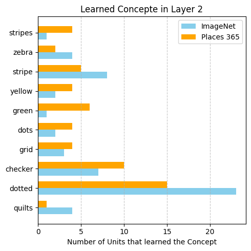

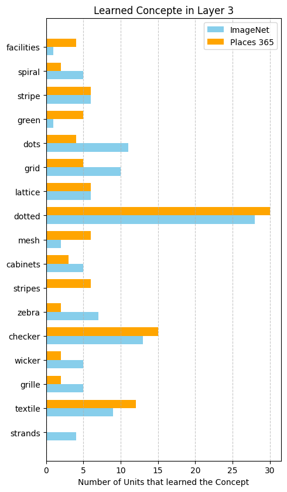

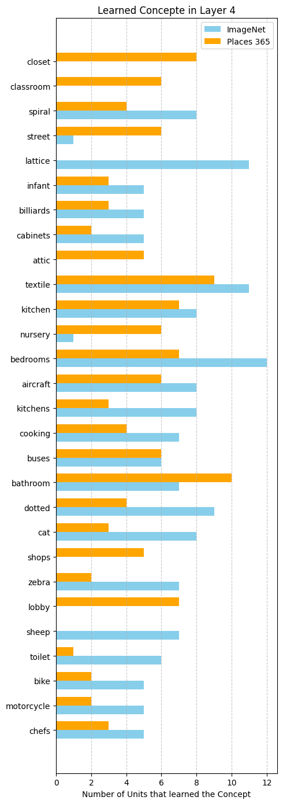

One can see that the complexity of the learned concepts increases with the depth of the layer. Most of the concepts leaned by units on layer 2 are very basic like patterns (dotted, checker, ...) or colors (green, yellow, ...) while units on the deeper layer 4 learned way more complex concepts like specific scenes (bedrooms, bathrooms, ...) or objects (aircraft, sheep, ...).

Comparing the two models one will notice that the model trained on the Places 356 dataset was able to learn specific scenes like classroom, attic or lobby that were not learned by the model trained on ImageNet. Vice versa the model trained on ImageNet learned to detect specific objects like lattice or sheep that are not detected by the other model. This difference is based on the different kind of images found in each of the dataset: Places 356 includes mostly pictures of scenes and environments while ImageNet has a wider variety of pictures and is more object focussed.

## Task 2 – Grad‑CAM, AblationCAM & ScoreCAM

The goal of Task 2 is to visualize and analyze which parts of each of the 10 provided images influenced the ResNet‑50 classifier’s top‑1 decision by comparing three complementary attribution methods:

1. **Grad‑CAM** – uses the gradients flowing into the last convolutional layer to produce a coarse localization heatmap.  
2. **AblationCAM** – systematically “ablates” (masks out) each feature map in the target layer to measure its effect on the output score, producing a more diffuse attribution map.  
3. **ScoreCAM** – generates attribution by scoring the effect of each upsampled activation map on the output, yielding sharper, higher‑contrast explanations.

The report of the task is in `reports/task2.pdf`
The output of the task is in `task2`. It contains 2 folder: `output_gradcam_mask_v2` which contains greyscale heatmap of the `GradCAM` and `output_gradcam_v2` contains output of each CAM methods separted by the directory.

## Task 3 - LIME

The goal of this task is to derive an explanation for image classification using Local Interpretable Model-agnostic Explanations (LIME). Given for the task are an image classifier (ResNet 50 trained on ImageNet) and 10 images of which the classification should be explained.

LIME works by reducing the number of features to a human comprehensible number and exploring which of these is most important to get to the given classification. This simplification is viable because LIME only explores the decision boundaries locally around the given data point and doesn't try to explain the entire decision process of the model.

For image classification this is done by splitting the input image into a small number of segments. The classifier is then run on only subsets of these segments while the remaining segments are masked out. A simple model is trained on what segments were used and the classifiers confidence for the correct class of the image. By this the model learns which segments are most important for the classifier to make the correct decision and also which segments contradict the classifiers decision. These segments can be highlighted in the output image to explain what parts of an image were relevant for the decision of the classifier.

For this task LIME was performed according to this tutorial: [LIME-Tutorial](https://github.com/marcotcr/lime/blob/master/doc/notebooks/Tutorial%20-%20images%20-%20Pytorch.ipynb). The code that was used is found in *task3/lime.ipynb*.

To create each of the explanation an explain instance had to be configured. Such an explain instance takes in a multitude of parameters that were fine tuned for each image to give the best possible result in as short of a time as possible. These parameters were submitted to the assignment API for grading of the explanation. Unfortunately the parameters had to be submitted as pickle-serialization, which does not support the serialization of lambda functions. This made it impossible to use anything but the default for the parameters *segmentation_fn* and *model_regressor* which expect wrapper functions to function of the *skimage* and *sklearn* modules.
During initial testing very good results were achieved using `slic(img, n_segments=x, compactness=y)` for segmentation which allows to specify the number of segments and how they are selected based on color and position.

This leaves the following parameters for tuning of explain instance:
- labels/ top_labels: labels that the models tries to explain. Set to top_label = 1 to explain only the label the classifier is most confident in. Exception is the image labeled as "kite" were it was set to 3 since the models classification is wrong.
- hide_color: color used to map out the unused segments. Set to either white, grey, black or None (defaults to average color of image).
- num_features: maximal number of features the explanation model should have. Corresponds to number of segments in the image. Lower number of features reduced complexity and are easier to comprehend. Number is set between 4 and 8, since bigger numbers usually didn't result in a more detailed/ more complete explanation mappings.
- num_samples: size of the neighborhood created to train the explanation model. Set as low as possible while still producing a good mapping to achieve a short execution time. Usually set around $2^{num\_features}$ since this should include all possible subsets.

The following images show the areas that were deducted to be the most relevant to the classification, given the mentioned configurations and limitations, for each of the sample images:

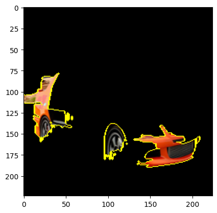

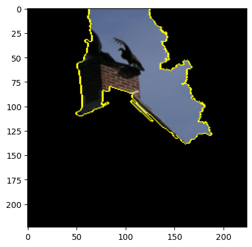

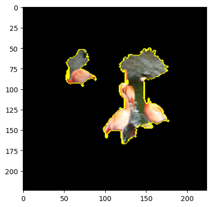

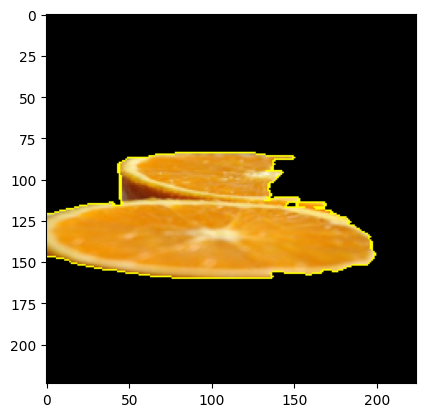

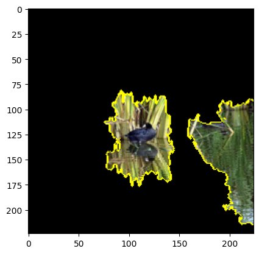

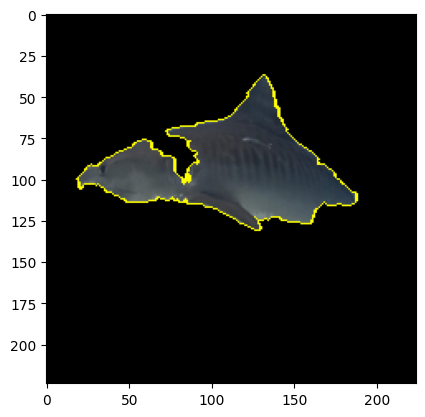

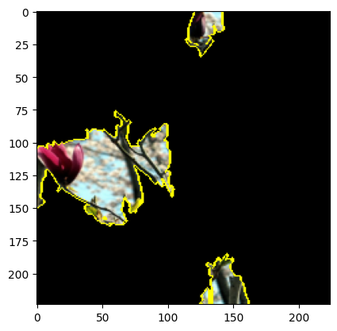

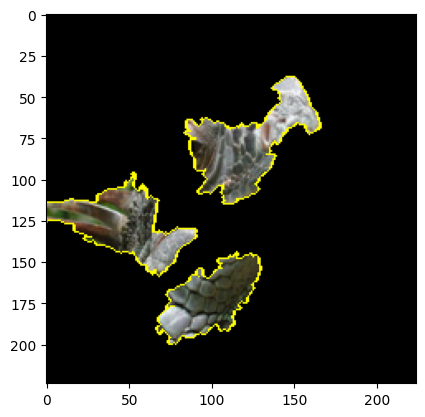

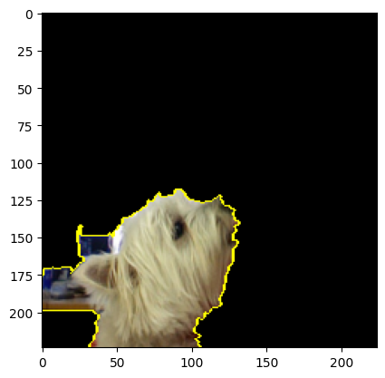

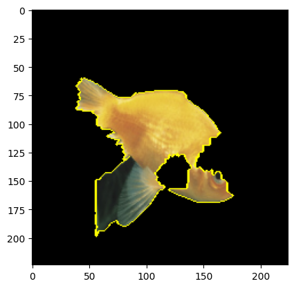

These LIME annotations were graded by the assignment API as foloows:
`{'avg_iou': 0.334783209795884, 'avg_time': 1.9471065044403075}`

Of course. Here is the final report, updated to integrate the quantitative IoU scores you provided.

---

## Task 4 - Comparative Analysis of Grad-CAM and LIME with IoU Scores

The goal of Task 4 is to compare and analyze the alignment between Grad-CAM and LIME, two fundamentally different explainability methods applied to the same 10 ImageNet images. The analysis is supported by quantitative Intersection over Union (IoU) scores to precisely measure the degree of agreement between the two methods' explanations.

The notebook is present in `task4` directory.
The full report is available in `reports/task4.pdf`.
